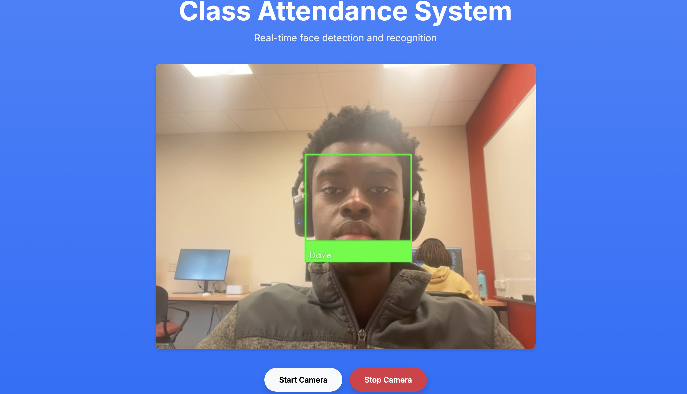
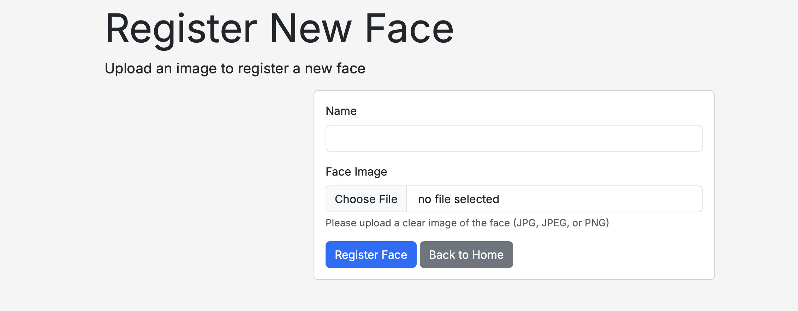
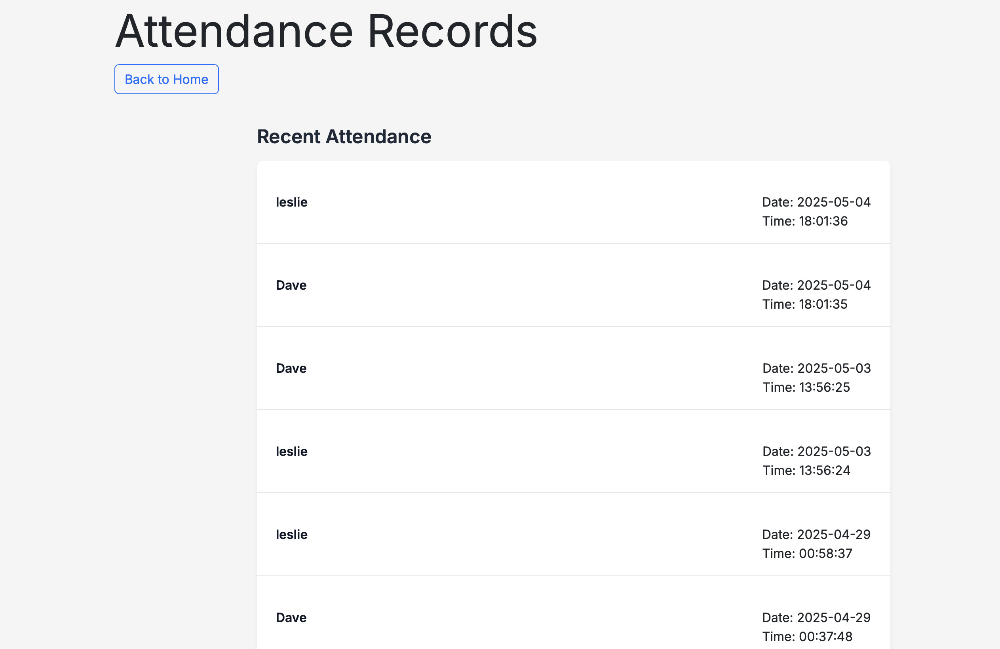
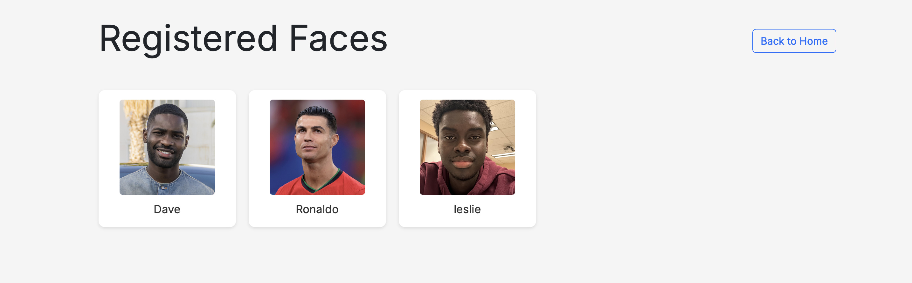

# 📘 Face Recognition Attendance System

A Flask-based web application for real-time **student attendance tracking** using **face recognition**. Users can register faces, detect and recognize them live via webcam, and view attendance history, all from a modern web interface.

---

##  Features

- Real-time face detection via webcam
-  Face recognition using `face_recognition` (built on dlib)
-  Easy face registration with image preview
-  Attendance records with timestamps
-  View all registered faces
-  Privacy notice page to inform users about data usage
-  Responsive Bootstrap UI with modern design

---

## Folder Structure

```
├── app.py                     # Flask backend
├── face_recognition_system.py # Face recognition logic
├── templates/
│   ├── index.html             # Home page with live feed
│   ├── register.html          # Face registration form
│   ├── view_faces.html        # List of registered faces
│   ├── attendance.html        # View attendance records
│   └── privacy_notice.html    # Privacy notice popup
├── static/
│   ├── css/
│   │   ├── style.css
│   │   └── privacy_notice.css
├── faces/                     # Stores uploaded face images
├── attendance.csv             # (optional) Attendance logs
├── requirements.txt           # Python dependencies
```

---

## ⚙️ Tech Stack

- **Python 3.10+**
- **Flask** – Web server
- **face_recognition** – Core face recognition engine
- **OpenCV** – Image capture and processing
- **Bootstrap 5** – Frontend styling

---

## 🛠️ Setup Instructions

### 🔧 1. Clone the Repository

```bash
git clone https://github.com/lesprgm/face-attendance-app.git
cd face-attendance-app
```

### 🐍 2. Set Up Virtual Environment

```bash
python -m venv venv
source venv/bin/activate  # On Windows: venv\Scripts\activate
```

### 📦 3. Install Requirements

```bash
pip install -r requirements.txt
```

If you face issues with `dlib`, make sure you have:
- CMake
- Boost
- GCC or Clang (on Mac/Linux)

### ▶️ 4. Run the App Locally

```bash
python app.py
```

Then open your browser and visit:  
**`http://127.0.0.1:5000`**

---

## 📸 Functional Routes

| Route         | Description                          |
|---------------|--------------------------------------|
| `/`           | Home page with live camera feed      |
| `/register`   | Upload image and name to register    |
| `/upload`     | Upload image for recognition         |
| `/attendance` | View attendance logs                 |
| `/view_faces` | See all registered faces             |
| `/privacy`    | Read privacy notice                  |

---

## Privacy by Design

- Users are informed via a **dedicated privacy notice**
- No images are stored permanently without consent
- You can use a sample image (e.g., of Ronaldo) to test safely

---

## 🖼️ Screenshots


### Homepage


### Register Face


### Attendance View


### Faces View


---

##  Known Issues

This project may have unresolved bugs or limitations.  
Please refer to the **[Issues](../../issues)** section of this repository for up-to-date details or to report new problems.

---

##  Credits

Developed by **Leslie Osei-Anane**  
Face Recognition Tutorial: (https://youtu.be/tl2eEBFEHqM?si=WZ4n19KU4zxzTZ91)  
GitHub: [@lesprgm](https://github.com/lesprgm)